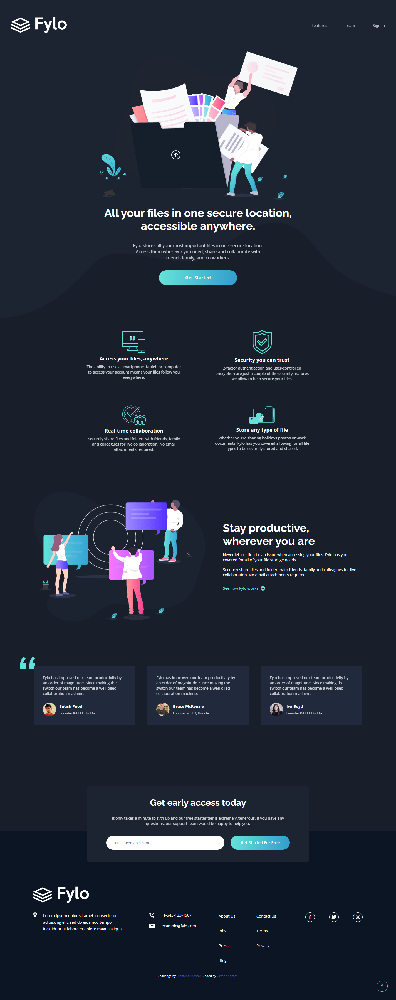

# Frontend Mentor - Fylo dark theme landing page

# Frontend Mentor - Fylo dark theme landing page solution

This is a solution to the [Fylo dark theme landing page challenge on Frontend Mentor](https://www.frontendmentor.io/challenges/fylo-dark-theme-landing-page-5ca5f2d21e82137ec91a50fd). Frontend Mentor challenges help you improve your coding skills by building realistic projects. 

## Table of contents

- [Overview](#overview)
  - [The challenge](#the-challenge)
  - [Screenshot](#screenshot)
  - [Links](#links)
- [My process](#my-process)
  - [Built with](#built-with)
- [Author](#author)

## Overview

### The challenge

Users should be able to:

- View the optimal layout for the site depending on their device's screen size
- See hover states for all interactive elements on the page

### Screenshot

### Links

- Solution URL: [Solution URL here](https://github.com/Gerson77/Fylo-dark-theme-landing-page)
- Live Site URL: [Live site URL here](https://fylo-dark-theme-landing-page-five-eta.vercel.app/)

### Built with

- Semantic HTML5 markup
- CSS custom properties
- Flexbox
- Mobile-first workflow

## Author
- Website - [Portifolio](https://portifolio-puce-theta-49.vercel.app/)
- Frontend Mentor - [@Gerson77](https://www.frontendmentor.io/profile/Gerson77)
- Linkedin - [@gerson-santos-silva](https://www.twitter.com/yourusername)
